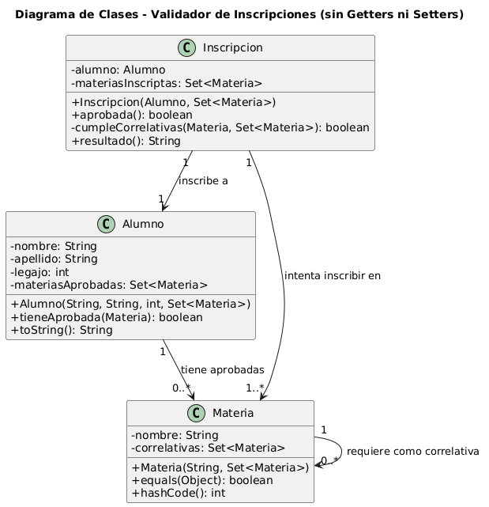
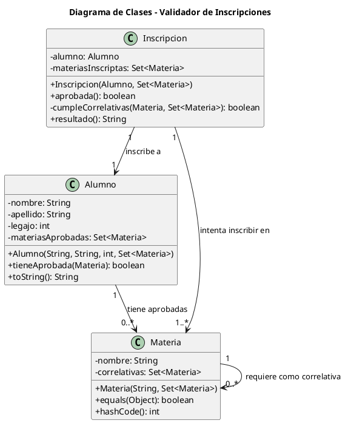

# Ejercicio Validador de Correlatividades - Diseño de Sistemas - Ariel Rotolo

## Diagrama UML

## Codigo UML

```plantuml
@startuml
' Omito todos los Getters y Setters para simplificar el diagrama
title Diagrama de Clases - Validador de Inscripciones

' Para mostrar los - y + en vez de colores
skinparam classAttributeIconSize 0

' Clase Alumno
class Alumno {
  - nombre: String
  - apellido: String
  - legajo: int
  - materiasAprobadas: Set<Materia>
  
  + Alumno(String, String, int, Set<Materia>)
  + tieneAprobada(Materia): boolean
  + toString(): String
}

' Clase Materia
class Materia {
  - nombre: String
  - correlativas: Set<Materia>
  
  + Materia(String, Set<Materia>)
  + equals(Object): boolean
  + hashCode(): int
}

' Definición de la clase Inscripcion
class Inscripcion {
  - alumno: Alumno
  - materiasInscriptas: Set<Materia>
  
  + Inscripcion(Alumno, Set<Materia>)
  + aprobada(): boolean
  - cumpleCorrelativas(Materia, Set<Materia>): boolean
  + resultado(): String
}

' --- Relaciones entre clases ---

' Relación: Inscripcion tiene un Alumno (Asociación 1 a 1)
Inscripcion "1" --> "1" Alumno : "inscribe a"

' Relación: Inscripcion incluye Materias a inscribir (Asociación 1 a Muchos, 1..* requiere al menos uno)
Inscripcion "1" --> "1..*" Materia : "intenta inscribir en"

' Relación: Alumno tiene Materias aprobadas (Asociación 1 a Muchos, 0..*)
Alumno "1" --> "0..*" Materia : "tiene aprobadas"

' Relación: Materia tiene Materias correlativas (Asociación reflexiva 1 a Muchos, 0..*)
Materia "1" --> "0..*" Materia : "requiere como correlativa"
@enduml
```
